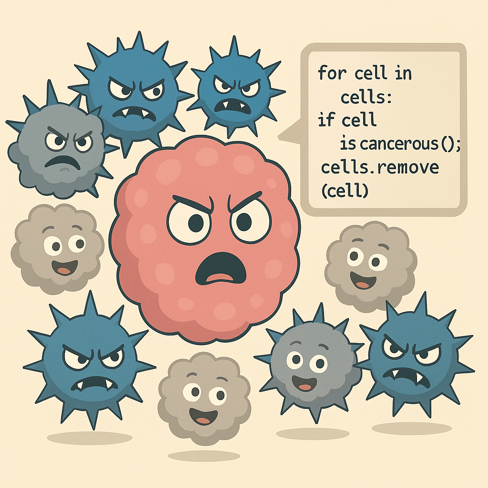

# Breast Cancer Classification with k-Nearest Neighbors (kNN)

In this project, I built a machine learning model to classify breast cancer tumor samples as either **benign** or **malignant**. The goal is to explore how kNN can help automate this process and optimize the model’s performance. By tuning the hyperparameters and improving accuracy, this work contributes to the potential of machine learning in healthcare.

The project is split into two parts:

### **Part 1: Data Exploration and Model Training**
In Part 1, I dive into the breast cancer dataset, clean up the data, and then train a **kNN classifier** to predict tumor classifications. I experiment with different values for **k** (the number of neighbors) and evaluate how the model performs on a test dataset. The aim here is to find the best **k** that gives us the highest accuracy and better understand the dataset’s features.

### **Part 2: Model Optimization and Prediction**
In Part 2, I take the model from Part 1 and optimize it using **grid search**. By searching for the best hyperparameters like **k** and the **weights** for neighbors (uniform or distance-based), I aim to push the model’s accuracy even further. Once I’ve found the best settings, I use the optimized model to classify new tumor samples from the `aim` dataset. Finally, I measure the model's performance on the test set and make predictions for unseen data.

---

**Key Highlights**
1. **Data Prep**: Loading and exploring the breast cancer dataset.
2. **Training**: Building the kNN classifier and training it on labeled tumor data.
3. **Evaluation**: Testing the model on unseen data and evaluating accuracy.
4. **Optimization**: Using **grid search** to fine-tune **k** and **weights** for the best results.
5. **Prediction**: Using the optimized model to classify new tumor samples.

---

**What’s in the Data?**
The dataset includes various features related to tumor cell characteristics, like:
- **Clump Thickness**
- **Uniformity of Cell Size**
- **Uniformity of Cell Shape**
- **Marginal Adhesion**
- **Bare Nuclei**
- **Bland Chromatin**
- **Mitoses**
- **Class (Benign = 0, Malignant = 1)**

The task? To predict whether a given tumor is **benign (0)** or **malignant (1)** based on these features.

---

**Model Optimization & Insights**
In **Part 2**, I optimize the **kNN classifier** by using **grid search** to explore:
- The number of neighbors (**n_neighbors**).
- How the neighbors are weighted (**uniform** vs **distance**).

After tuning these parameters, I apply the **best model** to predict tumor malignancy in the `aim` dataset, even when the **class** label is missing. These predictions are stored in the `class_pred` column.

---

**How It Works**
1. **Load the Data**: Load the training, test, and `aim` datasets.
2. **Build the Model**: Create the kNN pipeline, including steps for data standardization and classification.
3. **Train & Optimize**: Train the model, fine-tune hyperparameters with grid search, and evaluate performance.
4. **Make Predictions**: Use the best model to predict tumor classifications on the `aim` dataset.
5. **Assess Performance**: Evaluate accuracy, and check how well the model performs using confusion matrices.

---

**The Results**
By the end of the project, I have developed a highly accurate kNN model that can classify breast cancer tumors as benign or malignant. This project demonstrates how machine learning can be leveraged in healthcare to automate tumor classification and potentially aid in early cancer detection.

---

**Tech Stack**
- **Jupyter Notebooks** (for interactive development)
- **Python** (the go-to language for data science)
- **Pandas** (for data manipulation)
- **Scikit-learn** (machine learning magic)
- **Matplotlib/Seaborn** (for visualizing results)
